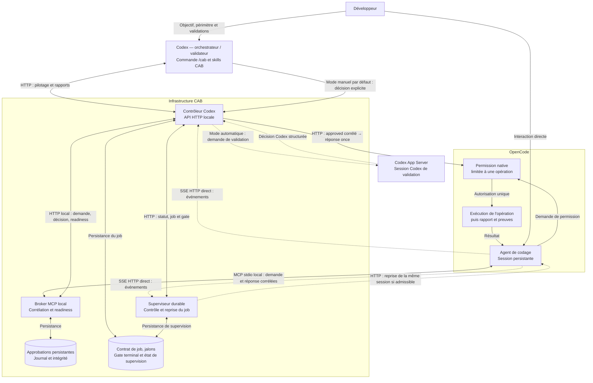

# Codex Approval Bridge — CAB - 100% IA

**CAB - Codex-Approval-Bridge** relie OpenCode et Codex pour fournir un cycle de validation explicite, persistant, observable et résilient.

Le bridge transporte les demandes de validation d'OpenCode vers Codex, conserve leur état, récupère la décision correspondante et restitue une réponse MCP corrélée à OpenCode.

Il ne décide jamais à la place de Codex et ne modifie pas le projet piloté.

Codex est l’orchestrateur et le validateur de la session : il pilote les
mandats du démarrage à la clôture et rend une décision explicite pour chaque
opération nécessitant une permission OpenCode. CAB transmet cette décision,
mais ne l’invente jamais. L’archivage OpenSpec est un mandat séparé, décidé
après contrôle de la cohérence et des validations.

```text
                    Développeur
                        │
            interaction / validation
                        │
             ┌──────────┴──────────┐
             ▼                     ▼
         OpenCode               Codex
      Agent de codage        Orchestrateur
             ▲                     │
             └──── Bridge MCP ─────┘
                                   │
                                   ▼
                                  GPT
                     Analyse / Revue / Validation
```

## Cadences de pilotage

Le protocole CAB prévoit les événements SSE en temps réel et le contrôle des
demandes et rapports toutes les **3 secondes**. Pendant l'analyse ou la
rédaction de l'agent de codage, les vérifications de progression sont espacées
de **7 secondes** fixes, indépendamment du contrôle CAB.

Après échec du benchmark PLLM, l'orchestrateur conserve le même RUN en attente
et retente toutes les **30 minutes**, sans limite de tentatives, jusqu'à
reprise sûre ou arrêt explicite du développeur. La reprise conserve les
contrôles CAB et les mandats unitaires. Les sondes statistiques sont prévues
toutes les **30 minutes**, sans arrêter le travail pour attendre le créneau.
Ces obligations du protocole distribué ne constituent pas un nouvel automate
de benchmark dans les composants CAB.

## Statistiques après archivage

Le plugin CAB embarque `coding-session-statistics`. Son protocole impose un
rapport `STATISTIQUES.md` dans chaque dossier d'archive OpenSpec après un
archivage autorisé et réussi, avant la clôture normale du travail. La collecte
est préparée dès le début du change ; les données absentes sont signalées
`N/A` sans estimation. Le suivi des quotas utilise l'outil natif Codex, sans
installation de `cgpt` ou de Tools Codex. Une erreur de publication doit être
résolue ou déclarée comme blocage, sans réarchiver le change.

## Architecture

```text
OpenCode
   │ MCP stdio
   ▼
CAB Broker
   │ HTTP local
   ▼
Contrôleur Codex ──► Codex App Server

OpenCode ── SSE HTTP direct ──► supervision CAB
```

Le broker MCP est **local en stdio** : aucun serveur MCP réseau n'est exposé.

## Architecture technique détaillée

Cette vue détaille les composants et les échanges du protocole CAB. Elle
distingue le transport MCP, les interfaces HTTP locales, la décision Codex,
la permission native OpenCode et la supervision du job.



- **Un mandat = une opération** : un fichier ou une commande, avec
  corrélation de `requestId`, `approval_id`, `change_id`, de la session et du
  répertoire.
- Le broker transporte et persiste ; **Codex décide**. Le contrôleur transmet
  l'approbation à la permission native correspondante avec une réponse
  `once`, consommable une seule fois.
- Les événements SSE et les relances techniques ne donnent aucune
  autorisation. Une décision absente ne vaut jamais approbation.
- Le gate terminal contrôle la clôture du job ; il reste distinct des
  décisions unitaires et ne remplace pas une permission OpenCode.
- Le mode manuel, utilisé par défaut, attend une décision HTTP explicite de
  l'orchestrateur sur `POST /decision/<requestId>`. Le mode automatique
  sollicite une session Codex de validation via Codex App Server.
- Le broker notifie le contrôleur sur `POST /validation/request` et récupère
  la décision sur `GET /decision/<requestId>`. La readiness est publiée
  séparément ; `READY` ne vaut jamais approbation.

Les cylindres représentent les états persistants des composants, sans
imposer un fichier ou un emplacement partagé. Les flèches en pointillés
identifient les voies SSE, les reprises techniques et le chemin de décision
du mode automatique.

## Ce que fournit CAB

- broker MCP persistant ;
- corrélation par `requestId` ;
- journal append-only et contrôle d'intégrité ;
- reprise après interruption ;
- watchdogs de validation et de session, avec relance corrélée du contrôleur
  toutes les trente secondes pour une décision PENDING ;
- readiness `READY / DEGRADED / BLOCKED / HUMAN_REQUIRED` ;
- diagnostic avec cause racine ;
- remédiations techniques contrôlées ;
- circuit breaker d'auto-remédiation ;
- contrôleur Codex local ;
- supervision SSE OpenCode ;
- superviseur durable de job et relance de la même session tant que le gate
  terminal reste ouvert ;
- plugin et skill Codex ;
- commande `/cab`.

## Commande `/cab`

`/cab` est une commande de l'agent Codex versionnée avec CAB. Elle orchestre
la communication entre le broker MCP et l'agent Codex ; elle ne prend jamais
de décision d'approbation.

```text
/cab start
/cab test
/cab run
/cab update
/cab stop
```

Chaque nouvelle session `/cab start` purge entièrement l'ancien état technique
CAB, y compris ses conflits Syncthing, sans le restaurer. Elle vérifie d'abord
l'inactivité du contexte, arrête les ressources CAB et déconnecte le broker
par OpenCode ; sources, secrets, rapports et historiques natifs restent hors
purge. Le plugin fournit l'outil de purge et son protocole. Une reprise
ordinaire conserve son état ; la seule exception de prévol divergent décrite
ci-dessous préserve le checkpoint métier hors runtime.

`/cab start` reconnecte et vérifie le MCP actif par `/mcp`, installe de façon différée les
services utilisateur du contrôleur et du superviseur sans les activer au
login, les démarre explicitement, initialise la supervision CAB, puis crée
une nouvelle session maîtresse persistante visible dans OpenCode.

`/cab test` réalise, dans cette même session, un test non destructif du chemin
complet OpenCode → MCP → CAB → Codex → CAB → OpenCode.

`/cab run` arme un contrat durable et maintient le job dans cette session. Tant
que son gate terminal reste ouvert, le superviseur réexamine la même session
après 60 secondes par défaut ; il ne crée ni session de remplacement ni
décision CAB. Chaque édition, commande Bash,
commande système, commande OpenSpec ou opération d’archivage est soumise par
OpenCode comme mandat unitaire, puis exécutée seulement après une décision
Codex corrélée. Une décision consommée ne déverrouille aucune autre action.

En cas de récupération sans effet non maîtrisé, l'orchestrateur peut remplacer
la session par `POST /job/recover` (`prepare`, puis `complete`) après contrôles
techniques et prévol CAB réservé. Le RUN reste ouvert ; le job, le périmètre et
le dernier jalon sont conservés. Le superviseur suspend les relances pendant
le gel et suit ensuite la nouvelle session. Les anciennes autorisations
exécutables ne sont jamais réutilisées. Un échec ou une preuve locale perdue
après redémarrage conserve le gel sans fabriquer de réussite. Voir
`TECHNICAL.md` et le protocole de la skill pour le contrat détaillé.

Les mandats lecture seule désactivent explicitement les outils natifs et
d'écriture dans le message OpenCode. Les opérations suivantes gardent leurs
permissions natives et décisions CAB unitaires.

`/cab stop` exige un gate terminal validé, arrête explicitement le superviseur
puis le contrôleur et les ressources CAB qu'elle a créées, sans fermer OpenCode
ni arrêter le broker MCP géré par OpenCode. Les unités utilisateur restent
installées mais inactives jusqu'au prochain
`/cab start`.

`/cab update` compare la version SemVer de base de `cab-approval-bridge` à
celle publiée par le marketplace Git `cab_codex_plugins`. Elle peut migrer de
façon réversible une source locale CAB vers `AzenorPixs/cab-codex-plugins`,
puis compare la commande CAB du profil Codex à celle de la branche `main`.
Elle installe ou actualise atomiquement le script et l'unité du superviseur
depuis le plugin installé, sans activer ni démarrer le service. Le remplacement
de la commande de profil est également atomique ; la configuration et les
ressources CAB en cours restent inchangées.
À la fin, elle récapitule les versions GitHub et locales du plugin, du
contrôleur, du superviseur déployé, du broker actif et de la commande CAB.

Après un prévol de récupération divergent ou incomplet prouvé et refusé sans
effet, le protocole déclenche une nouvelle session CAB avec purge des deux
espaces techniques résolus, sans nouvelle confirmation après le feu vert.
Les champs ou délais prescrits omis sont couverts ; deux écarts simultanés
ne sont plus nécessaires. Cette exception exige propriété/inactivité prouvées,
permissions neutralisées et checkpoint métier préservé hors purge. Nouveau
job, identifiants neufs et prévol exact avec le bon change sont requis avant
reprise, sans rejouer les écritures validées. Une nouvelle divergence sûre
relance la procédure et garde le RUN parent non terminal. Un timeout MCP seul
conserve le polling de la même approbation ; effet inconnu, preuve absente,
espace partagé ou purge partielle bloque la reprise automatique.
OpenCode reste ouvert ; la récupération ordinaire reste sans purge et les
gardes de l'outil de purge sont conservées. L'automatisation est effectuée par
l'orchestrateur appliquant le protocole distribué, sans nouvel automate dans
le broker ou l'API `/job/recover`.

## Organisation du dépôt
terme
```text
CAB/
├── src/                       # bridge Python initié par OpenCode
├── .codex/commands/cab.md     # commande /cab pour Codex
├── .agents/plugins/marketplace.json # marketplace Codex
├── plugins/cab-approval-bridge/     # plugin Codex
│   ├── .codex-plugin/plugin.json
│   ├── skills/approval-bridge/SKILL.md
│   └── scripts/
├── PROJECT.md                 # architecture générale
├── TECHNICAL.md               # fonctionnement technique
├── BUILD.md                   # construction et distribution
└── CHANGELOG.md               # Suivi de versions
```

## Prérequis

Le fonctionnement actuel repose sur :

- Python 3 ;
- OpenCode avec MCP local `stdio` ;
- Node.js ;
- Codex App Server ;
- accès local à OpenCode ;
- environnement Unix pour les mécanismes de persistance/verrouillage ;
- `systemctl --user` pour le mécanisme actuel de redémarrage automatique du contrôleur.

Le broker Python n'utilise actuellement aucune dépendance Python tierce.

## Configuration principale

### Broker

| Variable | Rôle |
|---|---|
| `CGPT_CONTROLLER_URL` | URL locale du contrôleur |
| `CGPT_APPROVAL_STORE` | magasin persistant des approbations |
| `CGPT_APPROVAL_JOURNAL` | journal append-only |
| `CGPT_BROKER_INSTANCE_LOCK` | verrou d'instance |
| `CGPT_JOURNAL_HMAC_KEY` | clé optionnelle du checkpoint HMAC |
| `CGPT_JOURNAL_HMAC_KEY_ID` | identifiant de la clé HMAC |
| `CGPT_JOURNAL_HMAC_PREVIOUS_KEYS` | anciennes clés autorisées en vérification |
| `CGPT_JOURNAL_CHECKPOINT_PATH` | chemin du checkpoint |

### Watchdogs

| Variable | Rôle |
|---|---|
| `CGPT_PENDING_WATCHDOG_INTERVAL` | fréquence du watchdog PENDING |
| `CGPT_PENDING_WATCHDOG_WARNING` | seuil de dégradation PENDING |
| `CGPT_PENDING_WATCHDOG_STALLED` | seuil de blocage PENDING |
| `CGPT_SESSION_WATCHDOG_INTERVAL` | fréquence du watchdog session |
| `CGPT_SESSION_WATCHDOG_WARNING` | seuil de dégradation session |
| `CGPT_SESSION_WATCHDOG_STALLED` | seuil de blocage session |

### Auto-remédiation

| Variable | Rôle |
|---|---|
| `CGPT_AUTO_REMEDIATION_ENABLE` | activation globale, désactivée par défaut |
| `CGPT_AUTO_REMEDIATION_ACTIONS` | allowlist des actions |
| `CGPT_AUTO_REMEDIATION_INTERVAL` | fréquence de l'ordonnanceur |
| `CGPT_AUTO_REMEDIATION_CB_FAILURE_THRESHOLD` | seuil d'ouverture du circuit breaker |
| `CGPT_AUTO_REMEDIATION_CB_FAILURE_WINDOW` | fenêtre des échecs |
| `CGPT_AUTO_REMEDIATION_CB_OPEN_SECONDS` | durée OPEN |
| `CGPT_AUTO_REMEDIATION_CB_STATE_PATH` | état persistant du circuit breaker |
| `CGPT_REMEDIATION_ORPHAN_TIMEOUT` | délai des tentatives orphelines |

### Contrôleur et supervision

| Variable | Rôle |
|---|---|
| `OC_Codex_WORKSPACE` | racine absolue du projet à piloter, sans liste de projets codée dans CAB |
| `OC_Codex_OUTSIDE_SANDBOX` | impose l'exécution hors sandbox |
| `OC_Codex_OPENCODE_URL` | URL locale OpenCode |
| `OC_Codex_STATUS_HOST` | adresse loopback du contrôleur : `127.0.0.1` ou `::1` |
| `OC_Codex_STATUS_PORT` | port local du contrôleur |
| `OC_Codex_RECONNECT_MS` | délai de reconnexion SSE |
| `OC_Codex_CONTROLLER_URL` | endpoint de statut utilisé par le healthcheck |
| `OC_Codex_READINESS_MAX_AGE_MS` | fraîcheur maximale de la readinessterme |
| `OC_Codex_SUPERVISOR_URL` | endpoint de statut du superviseur utilisé par le healthcheck |
| `OC_Codex_SUPERVISOR_STATUS_HOST` | adresse loopback du superviseur |
| `OC_Codex_SUPERVISOR_STATUS_PORT` | port local du superviseur, `8789` par défaut |
| `OC_Codex_SUPERVISOR_RESUME_DELAY_MS` | délai de reprise, 60 secondes par défaut |
| `OC_Codex_SUPERVISOR_POLL_INTERVAL_MS` | fréquence de réconciliation du superviseur |
| `OC_Codex_SUPERVISOR_STATE_PATH` | état runtime non versionné du superviseur |
| `CODEX_COMMAND` | commande utilisée pour Codex App Server |

Les noms historiques équivalents préfixés `OC_CGPT_` restent acceptés pour la
compatibilité avec les installations existantes.

Le mode `OC_Codex_DECISION_MODE=manual`, utilisé par défaut, conserve les
demandes en attente d'une décision HTTP explicite de l'orchestrateur
principal. Les rappels corrélés restent observables sans créer de thread ni
de tour Codex auxiliaire. Le mode `automatic` conserve son fonctionnement.

Les secrets doivent rester hors du dépôt Git et des journaux.

## Persistance

Par défaut, le broker utilise le home du processus OpenCode qui le lance :

```text
$HOME/.opencode/state/cgpt-approval-bridge/
```

Le contrôleur et le superviseur utilisent par défaut l'espace situé dans le
workspace du projet piloté :

```text
<workspace>/.opencode/state/cgpt-approval-bridge/
```

Les variables de configuration peuvent personnaliser les chemins du broker
et celui de l'état du superviseur. Les espaces runtime doivent être résolus
depuis la configuration effective ; `/workspace` est seulement un exemple de
racine de projet. Ces espaces ne sont pas des sources du projet et ne doivent
pas être publiés avec une release.

Le contrôleur démarre sans job uniquement si son fichier de contrat est
absent. Un JSON malformé ou une autre erreur de lecture interrompt son
démarrage avec un diagnostic sans contenu persistant. Le fichier est conservé
pour une intervention autorisée ; aucun état n'est réparé automatiquement.

## Readiness

CAB expose quatre états :

- **READY** — fonctionnement nominal ;
- **DEGRADED** — fonctionnement possible mais dégradé ;
- **BLOCKED** — progression bloquée ;
- **HUMAN_REQUIRED** — intervention humaine nécessaire.

## Distribution

Le dépôt contient directement les sources du bridge et du plugin Codex. La
marketplace est définie dans `.agents/plugins/marketplace.json` et référence
le plugin situé dans `plugins/cab-approval-bridge/`.

Pour une marketplace GitHub privée, publiez le dépôt avec ce catalogue à sa
racine, puis importez et synchronisez-le depuis l'administration de votre
espace de travail Codex. Le compte GitHub connecté doit pouvoir lire le dépôt.

La version de base actuelle du broker, du contrôleur, du superviseur et du
plugin est `0.87.1`. Le plugin ajoute un cachebuster Codex pour les
installations locales.

## Documentation

- **ORCHESTRATED_CODING.md** — document facultatif, réservé aux projets
  nécessitant des sessions pilotées ; AGENTS.md impose alors sa lecture aux
  deux agents concernés pour le protocole et ses contrats techniques.
- **PROJECT.md** — but, architecture et périmètre ;
- **TECHNICAL.md** — protocoles, persistance, supervision et configuration ;
- **BUILD.md** — installation, packaging et distribution ;
- **CHANGELOG.md** — historique des versions.
- **openspec/specs/** — contrats normatifs des capacités CAB.
